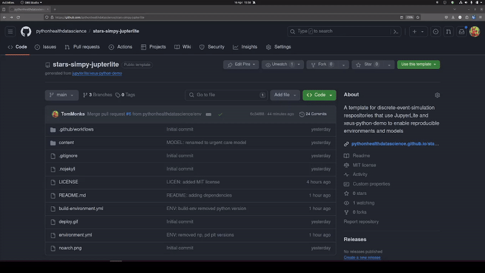
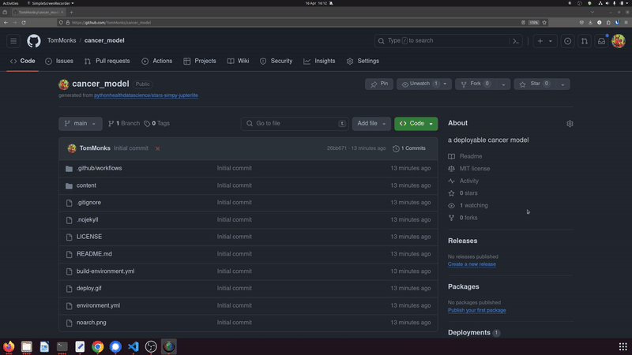

[](https://theopensciencenerd.github.io/jupyterlite-sharing-models)
[](https://opensource.org/licenses/MIT)
[](https://orcid.org/0000-0003-2631-4481)

#  JuypterLite template for sharing your computer models

## 1. Overview

This repository provides learning materials for JupyterLite: the Jupyter-Lab IDE powered by WebAssembly. It specifically focus on an implementation using `xeus-python`.

Packages available to you in the JupyterLite Website are:

* `matplotlib`
* `numpy`
* `pandas`
* `simpy`

> Try it in your browser now: https://theopensciencenerd.github.io/jupyterlite-sharing-models

### 1.1. Use cases

* A data science researcher wishes to share a runnable version of a computational model used in a published journal article. The code allows others to replicate the models results, tables and charts in a paper and allows others to reuse the model.
* The researcher wants the model to be immediately usable. Users should not need to install python or any other dependencies.
* The researcher either wants to reduce load on online open science compute infrastructure (e.g. mybinder.org) or does not want to rely on it. 
* Users may want to use a version of their own data due to governance, ethics or other reasons **cannot upload the data to a remote instance of the model.**
* Loading the model is as simple as clicking a URL.

### 1.2. Credits ✨

> We would like to thank the [JupterLite](https://github.com/jupyterlite/jupyterlite) and [xeus-python](https://github.com/jupyter-xeus/xeus-python) developers for making this work possible. This discrete-event simulation model used in this repository was based on the learning materials and template provided by [Jupyterlite xeus-python demo](https://github.com/jupyterlite/xeus-python-demo) and [tutorial given at PyData 2023](https://www.youtube.com/watch?v=WXRslU9D3bo) by Jeremy Tuloup.

### 1.3. Citation

If you use the template in your work we would greatly appreciate a citation when you publish your work. **Please also cite the JupyterLite Team.**

> Monks, T.,(2024). TheOpenScienceNerd JupyterLite Template (v0.1.0). Zenodo. https://doi.org/10.5281/zenodo.14537478

```
@software{osnerd_jupyterlite_template,
  author       = {Monks, Thomas},
  title        = {TheOpenScienceNerd JupyterLite Template},
  month        = Dec,
  year         = 2024,
  publisher    = {Zenodo},
  version      = {v0.1.0},
  doi          = {10.5281/zenodo.14537478},
  url          = {https://doi.org/10.5281/zenodo.14537478}
}
```

## 2. The example model included

The `simpy` model is adapted from [Monks, Harper and Mustafee (2024)](https://www.tandfonline.com/doi/full/10.1080/17477778.2024.2347882?src=exp-mr)

> Monks, T., Harper, A., & Mustafee, N. (2024). Towards sharing tools and artefacts for reusable simulations in healthcare. Journal of Simulation, 1–20. https://doi.org/10.1080/17477778.2024.2347882

Full documentation of this model is available in our [JupyterBook](https://pythonhealthdatascience.github.io/stars-simpy-example-docs)

In summary, we adapt a textbook example from Nelson (2013): a terminating discrete-event simulation model of a U.S based treatment centren summary the model. The example is based on exercise 13 from Nelson (2013) page 170.

> *Nelson. B.L. (2013). [Foundations and methods of stochastic simulation](https://www.amazon.co.uk/Foundations-Methods-Stochastic-Simulation-International/dp/1461461596/ref=sr_1_1?dchild=1&keywords=foundations+and+methods+of+stochastic+simulation&qid=1617050801&sr=8-1). Springer.*

## 3. Using the template to create a new repo.

> There are three steps: i.) create a new repo form the template; ii.) modify you repo settings so that GitHub pages are built from Actions.  iii.) Commit changes and trigger the GitHub Action and deployment. We recommend reading all instructions first.

Let's assume you wanted to create a new discrete-event simulation model of cancer services.  

1. The first step is to copy the template. Click on the green "use this template" button in the top right and select "create a new repository"
2. You will be prompted to enter a name of the repository - e.g. `cancer_model` - and a short description
3. Click on "Create Repository"



The JuypterLite interactive website is built from GitHub actions.  **In the newly created repo for your model** do the following

4. Navigate to "Settings->Pages"
5. Under "Build and Deployment" set the "Source" to "GitHub actions".



By default the build is triggered on any commit to the `main` branch.  Push a small commit and it will trigger the build.  This will take a few minutes.  Your site will be published under https://{USERNAME}.github.io/{DEMO_REPO_NAME}

## 4. How to install extra packages. 📦

The repo contains two environment files. To install more dependencies for your model and analysis you need to edit the ``environment.yml`` file.

The template ``environment.yml`` is as follows:


```yml
name: xeus-python-kernel
channels:
  - https://repo.mamba.pm/emscripten-forge
  - conda-forge
dependencies:
  - xeus-python
  - ipycanvas
  - simpy=4.1.1
  - numpy
  - pandas
  - matplotlib
```

**Key points:**

* There are two channels in use. 
  * `enscription-forge` contains specific versions of the packages for web assembly These include `numpy` `pandas`, and `matplotlib`. Other popular packages include `scipy`, `scikit-learn` and `pytest`.
  * `conda-forge` for other installs you can use conda-forge.  Only ``no-arch`` packages from ``conda-forge`` can be installed. For example above the package simpy is no-arch.  **If your build fails** then a good thing to check is if all packages are ``no-arch``.
* Note that `numpy`, `pandas` and `matplotlib` have specific versions available on `enscription-forge`. For this reason we recommend not including the package version number.
* `simpy` is installed from `conda-forge` we were therefore able to freeze the version to 4.1.1 to aid reproducibility.
* At the time of writing the xeus-python kernal will use python 3.11.3

As an example modification assume that you wanted to add two new packages: `plotly` and `scipy`.  The first `plotly` is available ``no-arch`` from conda-forge so it is safe to include and if you wanted to you could try to include a version number. There is a specific version of `scipy` is available on `encription-forge`

Our modified environment looks like:

```yml
name: xeus-python-kernel
channels:
  - https://repo.mamba.pm/emscripten-forge
  - conda-forge
dependencies:
  - xeus-python
  - ipycanvas
  - simpy=4.1.1
  - numpy
  - pandas
  - matplotlib
  - plotly
  - scipy
```